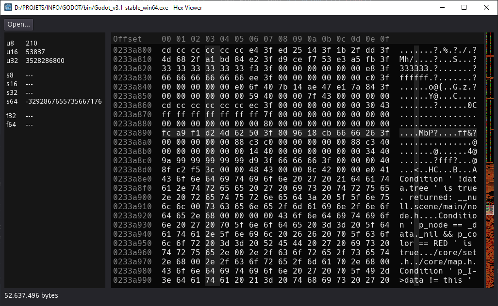

Hex Viewer
============

This is a hex file viewer made with Godot Engine.

Features:

- Binary view using hex numbers in 16 columns
- ASCII view with cursor highlight matching the hex view
- Zeroes are highlighted dimmer
- Quick primitive parsing at hovered offset
- Simple pattern language to match data structures (WIP)
- Colored minimap
